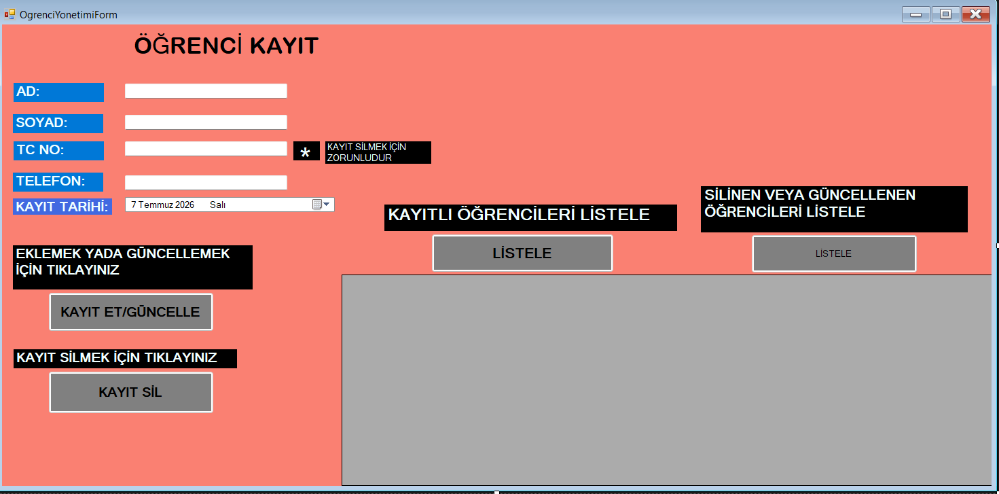
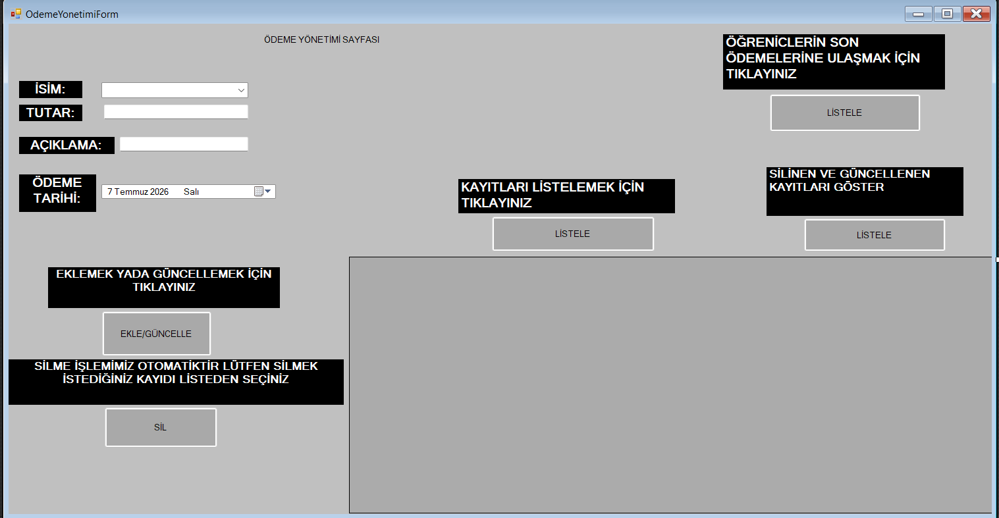
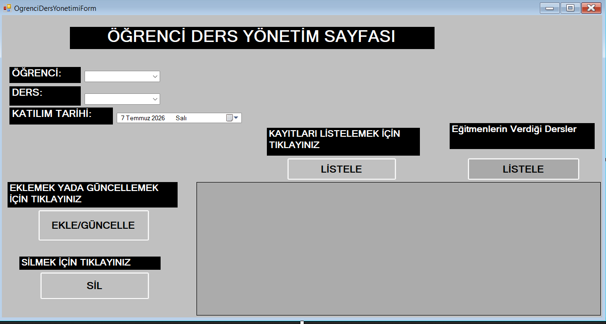
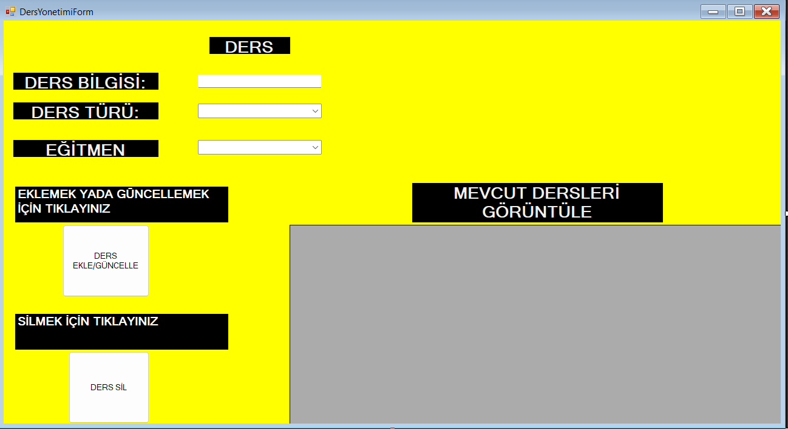
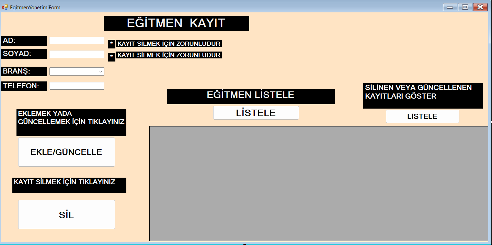
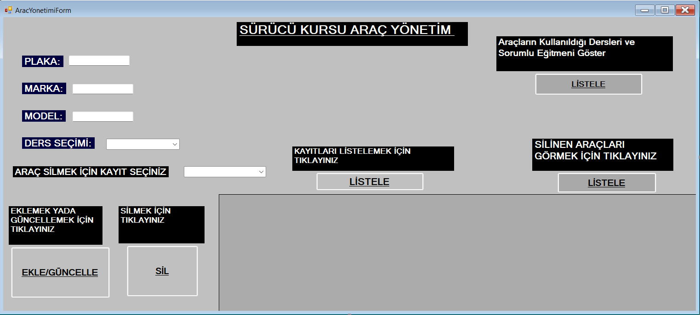
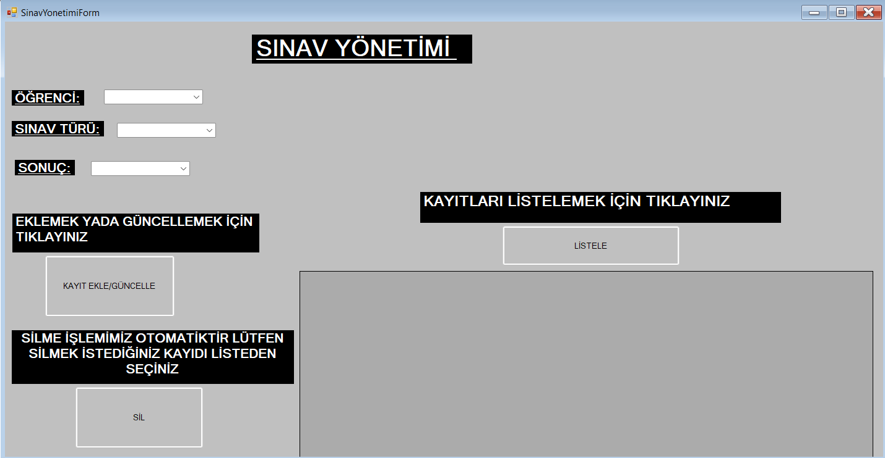

# Sürücü Kursu Yönetim Sistemi 🚗📝

Bu proje, bir sürücü kursunun günlük operasyonel süreçlerini (Araç, Ders ve Eğitmen yönetimi) dijitalleştirmek ve kolayca yönetmek amacıyla geliştirilmiş bir **C# Windows Forms** masaüstü uygulamasıdır. Arka planda **SQL Server** ilişkisel veritabanı mimarisi kullanılmıştır.

---

## 🚀 Öne Çıkan Özellikler

* **Öğrenci & Kayıt Yönetimi:** Kursa kayıt olan yeni kursiyerlerin kimlik, ehliyet sınıfı ve iletişim bilgileriyle sisteme eklenmesi ve takibi.
* **Ödeme Yönetimi:** Kursiyerlerin taksit ve toplam ödeme dengelerinin finansal olarak izlenmesi.
* **Araç Yönetimi:** Sürücü kursuna ait araçların eklenmesi, güncellenmesi, silinmesi ve hangi ders için tahsis edildiğinin yönetilmesi.
* **Ders Yönetimi:** Teorik derslerin ve direksiyon (sürüş) derslerinin eğitmen eşleştirmeleriyle birlikte sisteme kaydedilmesi.
* **Eğitmen Yönetimi:** Kurs bünyesindeki eğitmenlerin branş (Sürüş/Teorik) ve iletişim bilgileriyle takibi.
* **Sınav Yönetimi:** Kursiyerlerin teorik ve direksiyon sınav tarihlerinin, aldıkları puanların ve başarı durumlarının merkezi takibi.
* **Gelişmiş Veritabanı Mimarisi:**
  * Veri güvenliği ve performans için tüm CRUD işlemleri **Stored Procedure (Saklı Yordamlar)** üzerinden yürütülür.
  * Araç ve eğitmen silme/güncelleme işlemleri arka planda otomatik olarak loglanır (`AracLog`, `EgitmenLog`).
  * Karmaşık veri birleştirmeleri (Araç-Ders-Eğitmen ilişkisi) SQL **View** yapıları kullanılarak tek tıkla listelenir.

---

## 📸 Uygulama Ekran Görüntüleri

### 1. Giriş Paneli
Sistem yöneticilerinin ve eğitmenlerin veritabanı kimlik doğrulaması ile yönetim paneline güvenli erişim sağladığı ekran.

### 2. Öğrenci Yönetimi
Kursa yeni başlayan kursiyerlerin tüm kişisel ve ehliyet sınıfı bilgilerinin kaydedildiği ve listelendiği alan.

### 3. Ödeme Yönetimi
Öğrencilerin kurs ücreti ödemelerini, kalan borç bakiyelerini ve makbuz kayıtlarını içeren finansal takip ekranı.

### 4. Öğrenci Ders Yönetimi
Hangi öğrencinin, hangi tarihte, hangi eğitmen eşliğinde derse katılacağını gösteren bireysel planlama paneli.

### 5. Ders Yönetimi
Kurs takvimindeki genel teorik derslerin ve direksiyon eğitim saatlerinin tanımlandığı arayüz.

### 6. Eğitmen Yönetimi
Sürücü kursunda görev yapan direksiyon ve teorik ders eğitmenlerinin branş ve iletişim bilgilerinin yönetildiği alan.

### 7. Araç Yönetimi
Eğitimlerde ve direksiyon sınavlarında kullanılan aktif araç filosunun marka, model, plaka ve müsaitlik durumu takibi.

### 8. Sınav Yönetimi
Kursiyerlerin sınav giriş bilgileri ile teorik ve pratik sınav sonuçlarının, başarı puanlarının girildiği panel.

---

## 🛠️ Kullanılan Teknolojiler ve Diller

* **Programlama Dili:** C# (.NET Framework 4.8)
* **Arayüz Teknolojisi:** Windows Forms (WinForms)
* **Veri Bağlantısı:** ADO.NET (SqlDataAdapter, SqlCommand)
* **Veritabanı:** MS SQL Server (Stored Procedure, Trigger, View Desteği ile)
* **ORM / Altyapı:** Entity Framework 6 & SQLite entegrasyon desteği (App.config altyapısı hazır)

---

## 🔧 Veritabanı Kurulumu (.BAK Yöntemi)

1. SQL Server Management Studio (SSMS) uygulamasını açın.
2. **Databases** sekmesine sağ tıklayıp **Restore Database...** seçeneğini seçin.
3. **Device** kısmından projedeki `Database/SurucuKursuDB.bak` dosyasını göstererek veritabanını tüm tablo, view ve procedure'leriyle birlikte geri yükleyin.

---

## 🔧 Nasıl Çalıştırılır?

1. Bu depoyu bilgisayarınıza indirin (clone).
2. `App.config` dosyasındaki `connectionString` alanını kendi yerel SQL Server (`Data Source=...`) bilgilerinize göre güncelleyin.
3. Proje dosyalarını **Visual Studio** ile açarak `Start` butonuna basabilir veya `F5` tuşuyla uygulamayı derleyip çalıştırabilirsiniz.